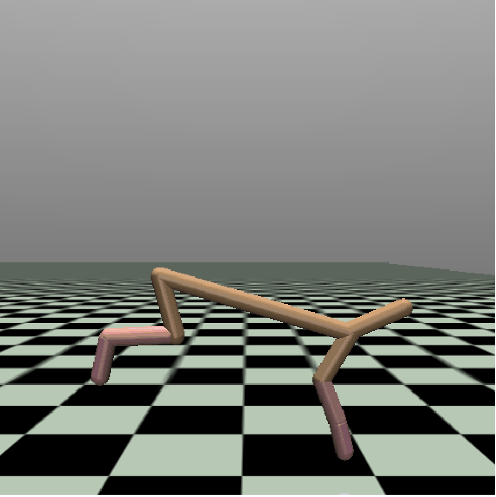
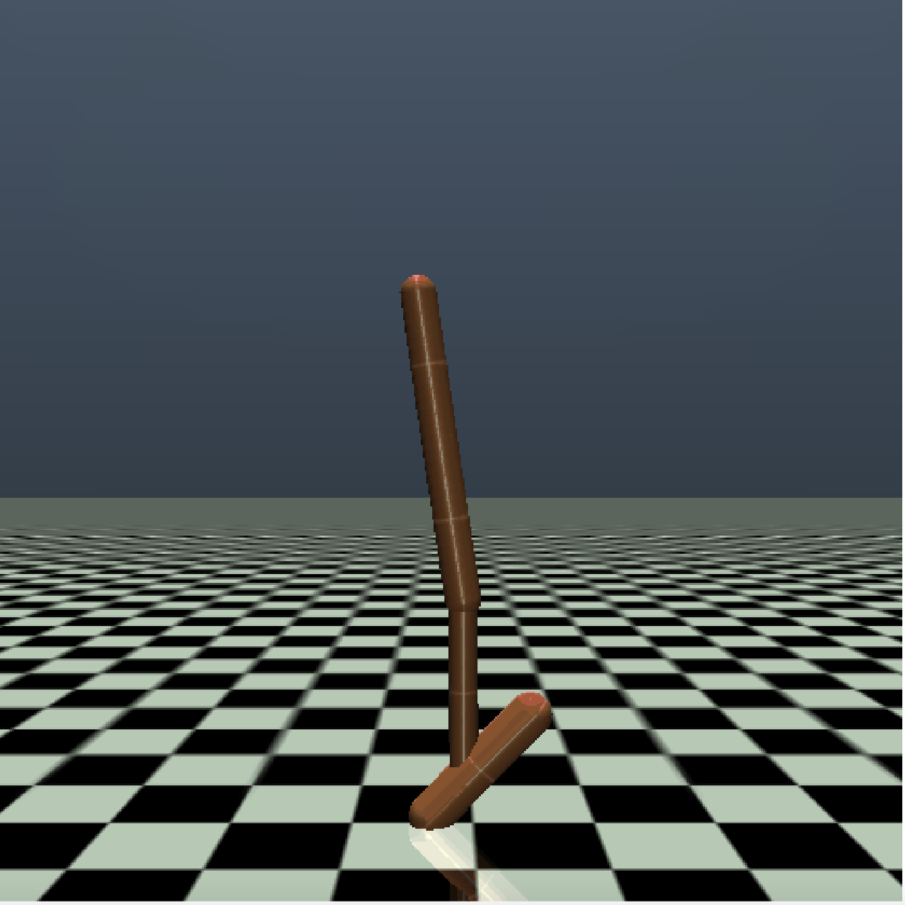
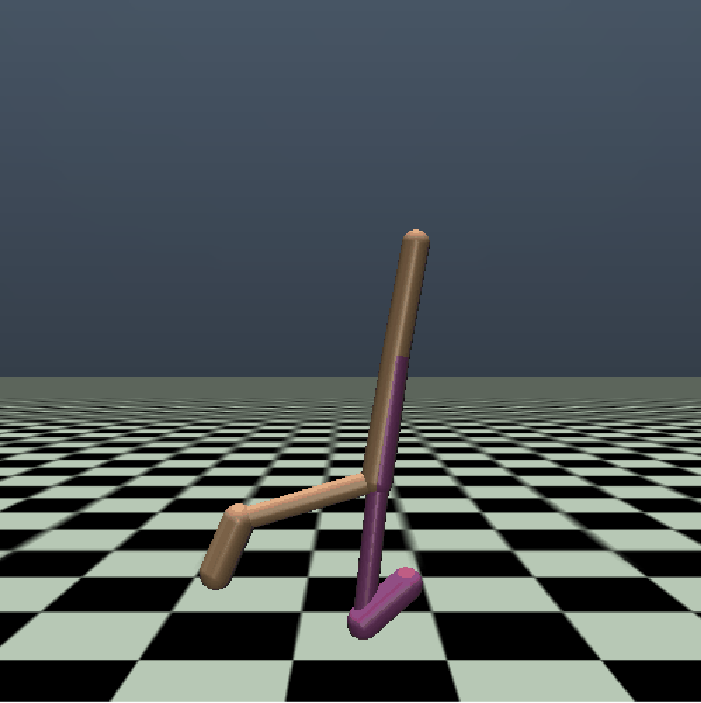

# policybazaar
A collection of multi-quality  policies for continuous control tasks.

[](https://github.com/koulanurag/policybazaar/actions/workflows/python-package.yml)

## Installation
It requires:

- [Python 3.6+](https://www.python.org/downloads/)
- [mujoco-py](https://github.com/openai/mujoco-py), [mujoco 200](https://www.roboti.us/index.html) and [mujoco license](https://www.roboti.us/license.html). Please, follow `mujoco-py` installation instructions from [here](https://github.com/openai/mujoco-py).
- [Pytorch >= 1.8.0](https://pytorch.org/)

Python package and dependencies could be installed using:
```bash
pip install git+https://github.com/koulanurag/policybazaar@main#egg=policybazaar
```
Or
```bash
git clone https://github.com/koulanurag/policybazaar.git
cd policybazar
pip install -e .
```

## Usage

```python console
>>> import policybazaar, gym, torch
>>> model, model_info = policybazaar.get_policy('d4rl:maze2d-open-v0',pre_trained=1)
>>> model_info
{'score_mean': 122.2, 'score_std': 10.61}

>>> episode_reward = 0
>>> done = False
>>> env = gym.make('d4rl:maze2d-open-v0')
>>> obs = env.reset()
>>> while not done:
...    action = model.actor(torch.tensor(obs).unsqueeze(0).float())
...    action = action_dist.mean.data.numpy()[0]
...    obs, reward, done, step_info = env.step(action)
...    episode_reward += reward
>>> episode_reward
120

>>> # Let's get dataset corresponding to a policy
>>> dataset = policybazaar.get_dataset('d4rl:maze2d-open-v0',pre_trained=1)
```

## Testing:

- Install: ```pip install -e ".[test]" ```
- Run: ```pytest```

## What's New:
- **11th May, 2021:**
    -  release(alpha3) includes cassie policies
- **29th Mar, 2021:**
    - Initial release(alpha2) with pre-trained policies for maze2d and some environments in mujoco(gym) which have been also used in d4rl.
    - policies were hand-picked
- **23rd Mar, 2021:**
    - Initial release(alpha1) with pre-trained policies for maze2d in d4rl. 

## Pre-trained Policy Scores
In the following, we report performance of various pre-trained models. These scores are reported over `20` episode runs.

### :small_blue_diamond: [d4rl:maze2d](https://github.com/rail-berkeley/d4rl/wiki/Tasks#maze2d)


| Environment Name |`pre_trained=1` (best) |`pre_trained=2`  |`pre_trained=3`  |`pre_trained=4` (worst) |
|:------: | :------: | :------: | :------: | :------: | 
|`d4rl:maze2d-open-v0`|122.2±10.61 |104.9±22.19 |18.05±14.85 |4.85±8.62 |
|`d4rl:maze2d-medium-v1`|245.55±272.75 |203.75±252.61 |256.65±260.16 |258.55±262.81 |
|`d4rl:maze2d-umaze-v1`|235.5±35.45 |197.75±58.21 |23.4±73.24 |3.2±9.65 |
|`d4rl:maze2d-large-v1`|231.35±268.37 |160.8±201.97 |50.65±76.94 |9.95±9.95 |
|`d4rl:maze2d-open-dense-v0`|127.18±9.17 |117.53±10.21 |63.96±16.03 |26.82±9.19 |
|`d4rl:maze2d-medium-dense-v1`|209.25±190.66 |192.36±193.29 |225.54±183.33 |232.94±184.62 |
|`d4rl:maze2d-umaze-dense-v1`|240.22±25.1 |201.12±21.35 |121.94±10.71 |45.5±44.53 |
|`d4rl:maze2d-large-dense-v1`|168.83±225.78 |239.1±208.43 |204.39±197.96 |90.89±70.61 |


### :small_blue_diamond: [d4rl:antmaze](https://github.com/rail-berkeley/d4rl/wiki/Tasks#antmaze)


| Environment Name |`pre_trained=1` (best) |`pre_trained=2`  |`pre_trained=3`  |`pre_trained=4` (worst) |
|:------: | :------: | :------: | :------: | :------: | 
|`d4rl:antmaze-umaze-v0`|0.0±0.0 |0.0±0.0 |0.0±0.0 |0.0±0.0 |
|`d4rl:antmaze-medium-diverse-v0`|0.0±0.0 |0.0±0.0 |0.0±0.0 |0.0±0.0 |
|`d4rl:antmaze-large-diverse-v0`|0.0±0.0 |0.0±0.0 |0.0±0.0 |0.0±0.0 |

### :small_blue_diamond: [mujoco(gym)](https://gym.openai.com/envs/#mujoco)
<p float="left">
     
    
    
</p>

| Environment Name |`pre_trained=1` (best) |`pre_trained=2`  |`pre_trained=3`  |`pre_trained=4` (worst) |
|:------: | :------: | :------: | :------: | :------: | 
|`HalfCheetah-v2`|1169.13±80.45 |1044.39±112.61 |785.88±303.59 |94.79±40.88 |
|`Hopper-v2`|1995.84±794.71 |1466.71±497.1 |1832.43±560.86 |236.51±1.09 |
|`Walker2d-v2`|2506.9±689.45 |811.28±321.66 |387.01±42.82 |162.7±102.14 |

***

### :small_blue_diamond: [cassie(gym)](https://github.com/koulanurag/cassie)

Dependency: ``` pip install -e ".[cassie]" ```

| Environment Name |`pre_trained=1` (best) |`pre_trained=2`  |`pre_trained=3`  |`pre_trained=4` (worst) |
|:------: | :------: | :------: | :------: | :------: | 
|`cassie:CassieWalkSlow-v0`|267.36±2.84 |- |- |- |
|`cassie:CassieWalkFast-v0`|208.78±68.99 |- |- |- |
|`cassie:CassieStand-v0`|289.93±2.03 |- |- |- |
|`cassie:CassieHop-v0`|184.27±71.62 |- |- |- |
